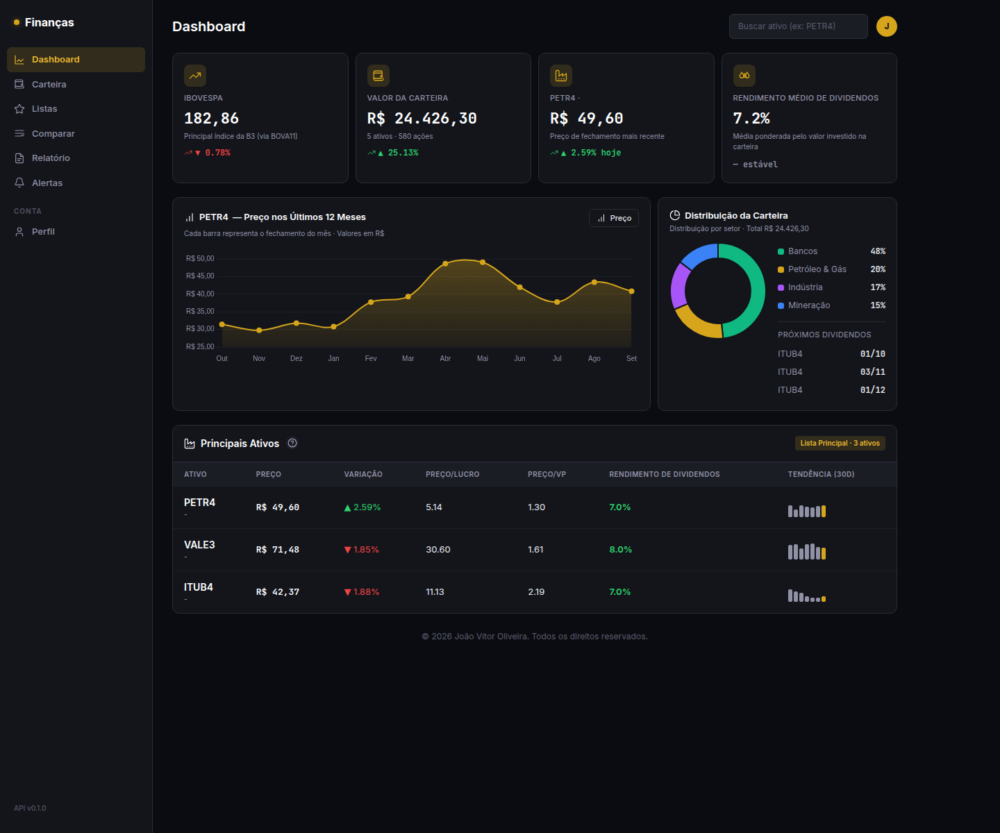
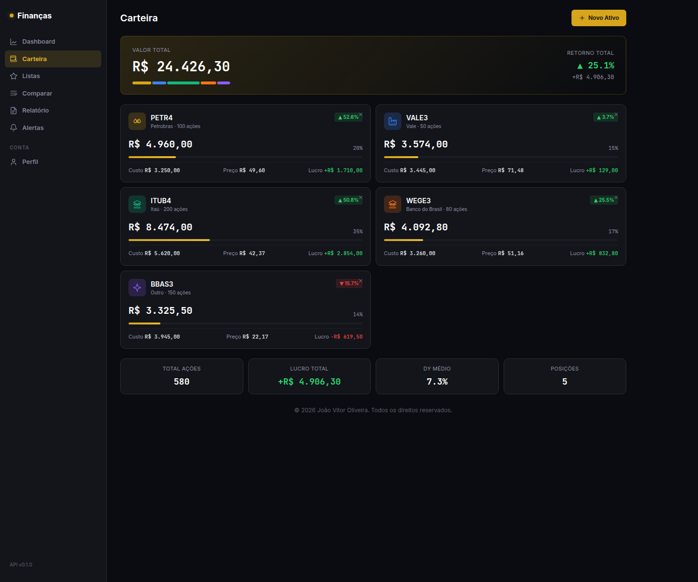
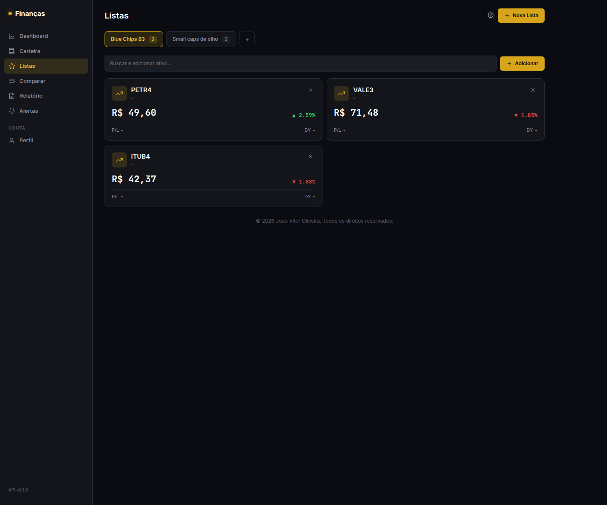
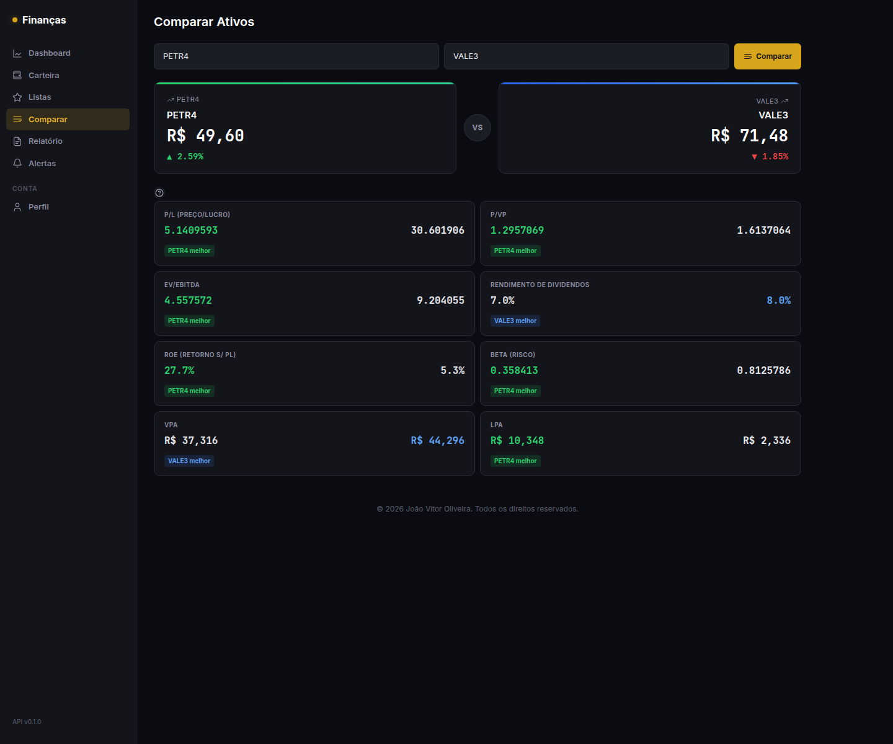
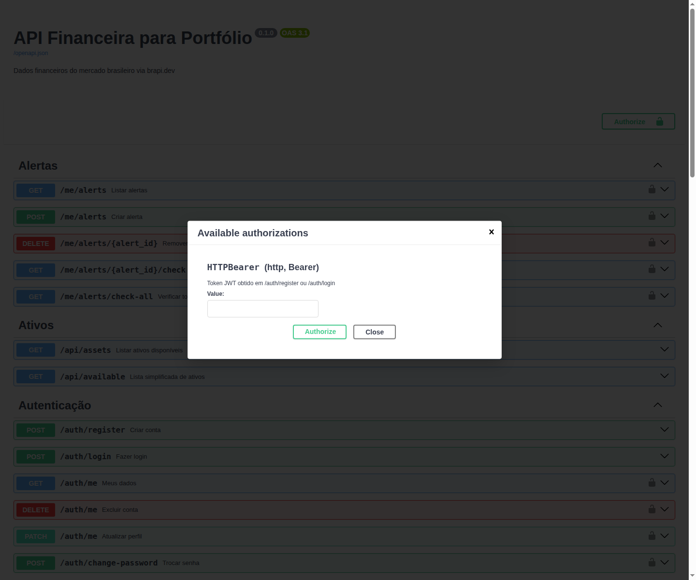
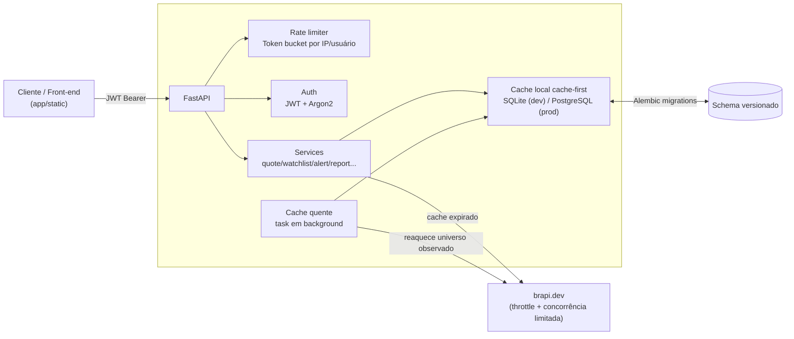

# API Financeira para Portfólio

API REST para consulta de dados financeiros do mercado brasileiro (B3),
consumindo dados da [brapi.dev](https://brapi.dev) com cache inteligente
e armazenamento local.

## Funcionalidades

- Cotação em tempo real de ações, FIIs, ETFs, BDRs
- Histórico OHLCV para gráficos de candle
- Dividendos e proventos (DIVIDENDO, JCP, BONIFICAÇÃO)
- Perfil da empresa
- Balanço Patrimonial e DRE
- Indicadores financeiros (ROE, ROA, P/VP, EV/EBITDA, etc.)
- Cache inteligente com TTL por tipo de dado
- Suporte a SQLite (dev) e PostgreSQL (prod)

## Stack

- **Python 3.12+** · **FastAPI** · **SQLAlchemy 2.0 (async)**
- **Pydantic v2** · **httpx** · **Alembic**
- **ruff** · **mypy** · **pytest**

## Screenshots

| Dashboard | Carteira |
|---|---|
|  |  |

| Watchlists | Comparar ativos |
|---|---|
|  |  |

Swagger com `HTTPBearer` registrado no OpenAPI — rotas autenticadas aparecem
com o cadeado e o botão "Authorize":



## Arquitetura



Cada leitura de dado de mercado é **cache-first**: o service tenta o
repositório local antes de chamar a brapi, com TTL por tipo de dado (cotação
ciente do pregão, fundamentos com TTL mais longo, OHLCV/dividendos
perpétuos). Uma task em background reaquece incrementalmente o cache dos
tickers observados (watchlists + alertas) dentro do orçamento do plano free
da brapi. Mais detalhes em [`docs/02-arquitetura.md`](docs/02-arquitetura.md)
e [`docs/06-rate-limit-e-cache.md`](docs/06-rate-limit-e-cache.md).

## Quick Start

```bash
# Clone
git clone <repo-url>
cd api-financeira-portfolio

# Ambiente virtual
python -m venv .venv
source .venv/bin/activate

# Dependências
pip install -e ".[dev]"

# Config
cp .env.example .env
# Edite .env com seu token brapi.dev

# Rodar (aplica as migrations do banco automaticamente no startup)
make dev
# ou: uvicorn app.main:app --reload

# Testes
make test
```

## Docker

```bash
# Sobe API + PostgreSQL
docker compose up --build

# A API aplica as migrations automaticamente no startup
# http://localhost:8000/docs
```

O `docker-compose.yml` usa PostgreSQL (via `asyncpg`) em vez do SQLite de
desenvolvimento local, espelhando a configuração de produção. Variáveis como
`BRAPI_TOKEN` podem ser passadas via `.env` na raiz do projeto (lido
automaticamente pelo `docker compose`).

## Migrations

O schema do banco é versionado com Alembic (`alembic/versions/`). A app
aplica as migrations pendentes (`alembic upgrade head`) automaticamente no
startup (`lifespan` em `app/main.py`) — não precisa rodar nada manualmente
para usar `make dev`.

```bash
# Aplicar migrations manualmente
make migrate

# Criar uma nova migration a partir de mudanças nos models
make migrate-create m="descrição da mudança"

# Desfazer a última migration
make migrate-down
```

## Documentação

- `/docs` - OpenAPI (automático pelo FastAPI)
- [`docs/01-dominio-e-visao.md`](docs/01-dominio-e-visao.md) - Domínio e entidades
- [`docs/02-arquitetura.md`](docs/02-arquitetura.md) - Arquitetura e padrões
- [`docs/03-tecnologias.md`](docs/03-tecnologias.md) - Stack e dependências
- [`docs/04-migracao-async-e-backlog.md`](docs/04-migracao-async-e-backlog.md) - Migração para SQLAlchemy async
- [`docs/05-revisao-seguranca.md`](docs/05-revisao-seguranca.md) - Auditoria de segurança (multi-tenancy, SQLi, vazamento de dados)
- [`docs/06-rate-limit-e-cache.md`](docs/06-rate-limit-e-cache.md) - Rate limiting e estratégia de cache

## Licença

MIT
